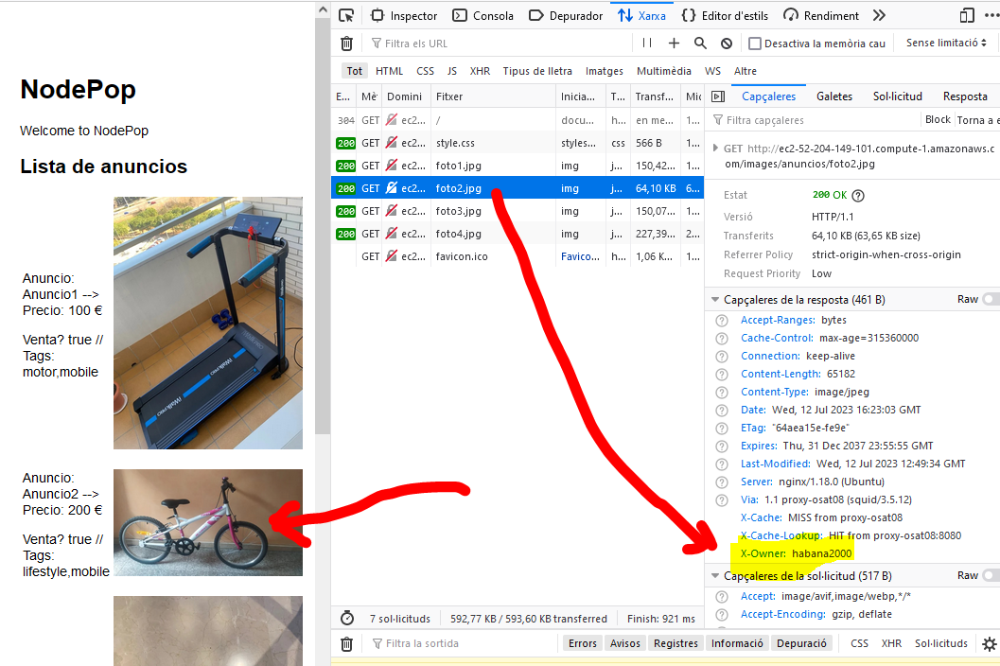
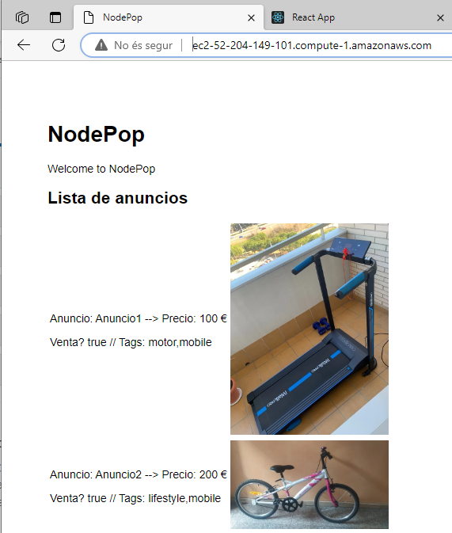
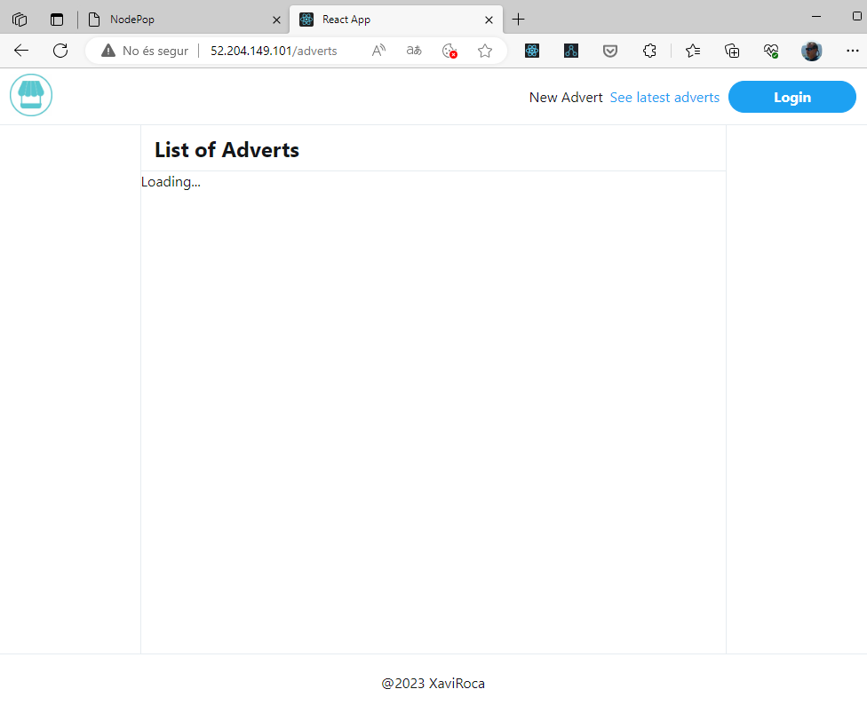

# PracticaDevOps
Práctica del módulo de Servidores y DevOps
* Alumno: **Xavi Roca**

#
# URLs 
* Ejercicio 1 --> _http://ec2-52-204-149-101.compute-1.amazonaws.com/_
* Ejercicio 2 --> _http://52.204.149.101/_


# Requerimientos práctica - Ejercicio 1
* Plataforma: AWS
* Repositorio práctica Backend-NodeJS: _https://github.com/KeepCodingWeb14/PracticaNodeJSDevOps.git_
* URL de la práctica desplegada: _http://ec2-52-204-149-101.compute-1.amazonaws.com/_
* Cuenta GitHub: **habana2000**


# Trabajo

## Consola AWS
* Creamos servidor EC2: **PracticaDevOps**
* claves: **practica.pem**
* IP Pública: **52.204.149.101**

## BASH
* Directorio /d/\_dummy (Donde está _practica.pem_)
* Conexión: *ssh -i practica.pem ubuntu@52.204.149.101
* sudo apt update
* sudo apt upgrade
* sudo apt install nginx
* Abrir puerto 80 en el servidor (AWS)

## Instalación BackendNodeJS

### Creación usuario
* Creació usuario: `sudo adduser app` (pwd: A********20)
* Bloqueamos su cuenta: `sudo passwd -l app`
* Nos convertimos en él: `sudo -u app -i`

### Instalar nvm + nodeJS
* Repo: _https://github.com/nvm-sh/nvm.git_
* Instalación: `wget -qO- https://raw.githubusercontent.com/nvm-sh/nvm/v0.39.3/install.sh | bash`
* Instalamos NodeJS: `nvm install node`

### Instalar MongoDB
* URL: _https://www.mongodb.com/docs/manual/tutorial/install-mongodb-on-ubuntu/_

### Instalar la aplicación
* Instalación
```sh
cd
git clone https://github.com/KeepCodingWeb14/PracticaNodeJSDevOps.git
cd PracticaNodeJSDevOps/nodepop
npm install
```

* Configuración reglas de seguridad: abrir puertos 3000 y 27017

* Uso
```sh
npm start
```

### Instalar PM2
* URL: _https://pm2.io/_

!DashboardPM2](images/PM2.PNG)

### Configuración nginx
* Editar fichero en sites-enable
* Eliminar el sites-enabled/default
* Crear link en sites-enabled
* Cerrar puerto 3000 y 27017 en consola AWS
* Ficheros estáticos servidos por NGINX
```sh
server {
        listen 80;
        server_name 52-204-149-101;

        location ~ ^/(images|stylesheets)/ {
                root /home/app/PracticaNodeJSDevOps/nodepop/public;
                access_log off;
                expires max;
                add_header X-Owner habana2000;
        }

        location / {
                proxy_pass http://127.0.0.1:3000;
                proxy_redirect off;
                proxy_http_version 1.1;
                proxy_set_header Upgrade $http_upgrade;
                proxy_set_header Connection "Upgrade";
                proxy_set_header Host $host;
        }
}
```



# Requerimientos práctica - Ejercicio 2
* Plataforma: AWS
* Repositorio práctica FundamentosReact: _https://github.com/habana2000/PracticaFundamentosReact.git_
* URL de la práctica desplegada: _http://52.204.149.101/_


## Preprativos
* npm run build del proyecto
* ubimos el directorio build al servidor: `scp -r -i /d/_dummy/practica.pem build ubuntu@52.204.149.101:/home/ubuntu`
* Muevo la carpeta a /var/www: `sudo mv build /var/www/react-anuncios`
* Configuramos fichero en /etcnginx/sites-available y lincamos en sites_enabled
* reiniciamos nginx

### Acceso por dominio AWS


### Acceso por IP



